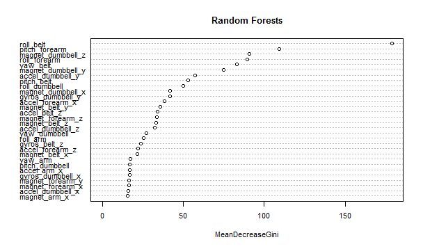
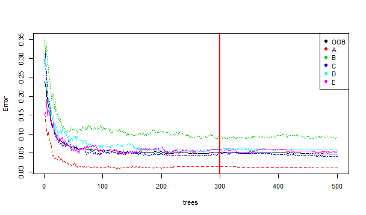
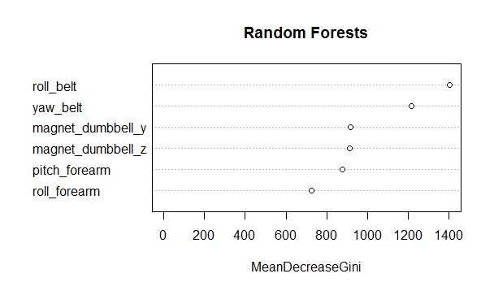
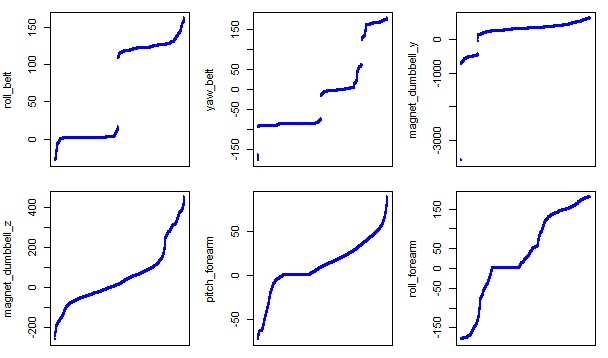
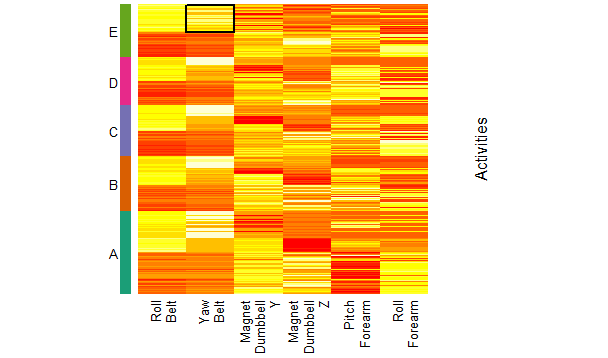

Prediciting exercise activities using Random Forests
========================================================

The objective of this assignment is to predict the activity done in 5 different ways of barbell lifts. For this purpose it was used data from accelerometers on the belt, forearm, arm and dumbbell of 6 participants, kindly ceded by Groupware.les.inf.

### Preprocessing
The test data consisted in 20 samples (observations) and 160 variables. Analyzing this variables was possible to exclude `r 160-52` variables since a few were not predictors (i.e. name of the athlete) and the majority didn't had values, although in the train data 406 observations had values for those specific variables.
```
testing <- read.csv("./pml-testing.csv", header=TRUE, sep=",", dec=".")  
training <- read.csv("./pml-training.csv", header=TRUE, sep=",", dec=".")  
trainingA <- training[ , -c(1:7,12:36,50:59,69:83,87:112,125:139,141:150)]  
testingF <- testing[ , -c(1:7,12:36,50:59,69:83,87:112,125:139,141:150)]  
```
As a preprocessing procedure it was used a center and scale method avaiable on the _caret_ package function _preProcess_.

### Variable selection
Since the train data consisted on 19622 observations, a computacional problem was posed. The processing time for each training model. For this reason the first split created by the function _createDataPartition_ consisted on 10% of the training data set observations and 51 variables as predictors. The computer has a 2.26GHz core duo processor and took 18 minutes to perform the first training using RStudio.
```
library(lattice); library(ggplot2); library(caret)  

inTrain <- createDataPartition(y=training2$classe, p=0.1, list=FALSE)  
training2 <- trainingA[inTrain, ]  
testing2 <- trainingA[-inTrain, ]  

library(e1071); library(randomForest)  

preProc <- preProcess(training2[ , -52], method=c("scale","center"))  
trainRF <- predict(preProc, training2[ , -52])  
modFit <- train(training2$classe ~., method="rf", data=trainRF, prox=TRUE)  
testRF <- predict(preProc, testing2[ , -52])  
confusionMatrix(testing2$classe, predict(modFit, testRF))  
```
After using the function _trControl=trainControl(method="oob")_ on the same training data set, the time went down to 1.5 minutes and the accuracy stayed within the confidence interval. Therefore, the training set was increased in a next step of the analysis.
```
modFit2 <- train(training3$classe ~., method="rf", trControl=trainControl(method="oob"), data=trainRF, prox=TRUE)  
testRF2 <- predict(preProc, testing2[ , -52])  
CM2 <- confusionMatrix(testing2$classe, predict(modFit2, testRF2))
```


As we can see in the above figure there is a big split between the 6th and 7th variable and probably the first 6 variables would be good predictors of the outcome _classe_, but after a few tests with 6, 9 and 11 variables, it was choosed the one with less variables, since the minimization of the in sample error, by including more variables was very small (approximately 1% on accuracy).
```
varImpPlot(modFit2$finalModel, main="Random Forests", cex=0.7)  
varImp(modFit2)  
colTrain <- rownames(which(varImp(modFit2)$importance > 35, arr.ind=TRUE))  
```
```{r, echo=FALSE}
load("C:/Biblioteca/Docs/E_formação/Coursera 201502 Data Science/201406 Pratical Machine Learning/project/AssignmentJorgePinheiro.Rdata")
print(CM2)
```
```
par(cex=0.7)  
plot(modFit$finalModel, main="")  
legend("topright", legend=colnames(modFit$finalModel$err.rate), col=1:6, pch=19)  
abline(v=300, lwd=2, col=2)  
```


In the above figure we can see the error rate across the number of trees used to fit the model. As we can see above 300th tree there isn't any significant aditional error reduction on any category of _classe_.

### Predicting using Random Forests
After a variable reduction, the training data set was again split by the function _createDataPartition_, resulting on a training data set of 40% and the remaining stayed as the testing data set. The training set wasn't larger because ocurred an error saying that cannot allocate a vector of size 1.0 Gb. Even so, as expected, the model accuracy increased.  
<b>The final model it was made with cross validation by spliting the training data set in 5 fold repeated 10 times. The expected out sample error is 4%.</b>
```
inTrain <- createDataPartition(y=trainingA$classe, p=0.4, list=FALSE)  
training3 <- trainingA[inTrain, c(colTrain,"classe")]  
testing3 <- trainingA[-inTrain, c(colTrain,"classe")]  

preProc3 <- preProcess(training3[ , -7], method=c("scale","center"))  
trainRF3 <- predict(preProc3, training3[ , -7])  
fitControl <- trainControl(method="oob", number = 5, repeats = 10, classProbs = TRUE, summaryFunction = twoClassSummary)  
modFit3 <- train(training3$classe ~., method="rf", trControl=fitControl, data=trainRF3, prox=TRUE)  
testRF3 <- predict(preProc3, testing3[ , -7])  
CM3 <- confusionMatrix(testing3$classe, predict(modFit3, testRF3))  
```
```{r, echo=FALSE}
# load("C:/Biblioteca/Docs/E_formação/Coursera 201502 Data Science/201406 Pratical Machine Learning/AssignmentJorgePinheiro.Rdata")
print(CM3)
```
### Conclusions
```
varImpPlot(modFit3$finalModel, main="Random Forests")  
```
As we can see in the following graphic the "Roll Belt" and "Yaw Belt" variabels are the ones that contribute more to classify the type of activity done by the athletes.



Analysing the values from each feature (variable), we can indentify some outliers in "Yaw Belt" and "Magnet Dumbbell Y", that should have been excluded from the analsyis.



A smaller number of variables, even in such a complex models like random forests, makes more easier to understand the results obtained. Like the example shown in the below figure by a square, where we can see that median values of Yaw Belt are associated with the exercise activity "E".



### Citations
Ugulino, W., Cardador, D., Vega, K., Velloso, E., Milidiu, R., Fuks, H. Wearable Computing: Accelerometers Data Classification of Body Postures and Movements. Proceedings of 21st Brazilian Symposium on Artificial Intelligence. Advances in Artificial Intelligence - SBIA 2012. In: Lecture Notes in Computer Science. , pp. 52-61. Curitiba, PR: Springer Berlin / Heidelberg, 2012. ISBN 978-3-642-34458-9. DOI: 10.1007/978-3-642-34459-6_6.  

Velloso, E., Bulling, A., Gellersen, H., Ugulino, W., Fuks, H. Qualitative Activity Recognition of Weight Lifting Exercises. Proceedings of 4th International Conference in Cooperation with SIGCHI (Augmented Human 13) . Stuttgart, Germany: ACM SIGCHI, 2013.