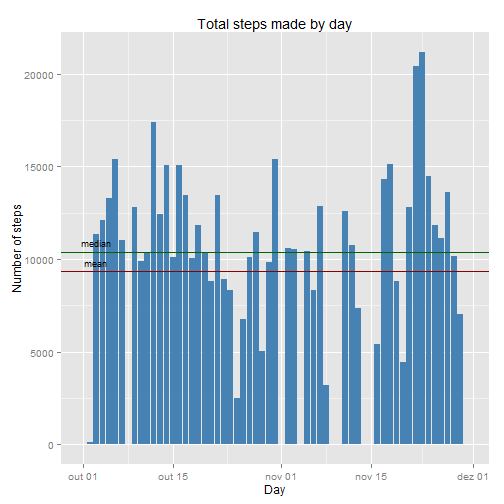
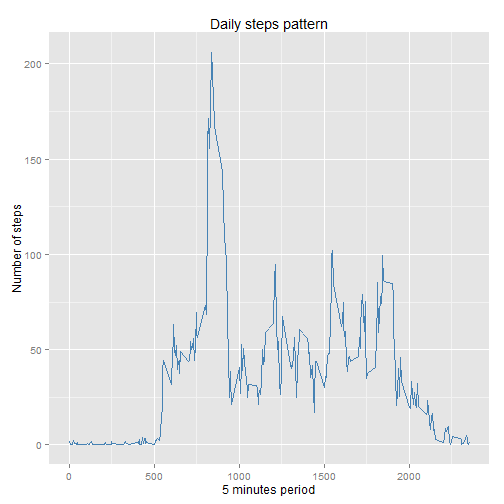
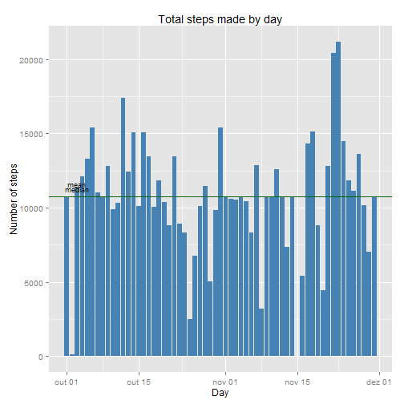
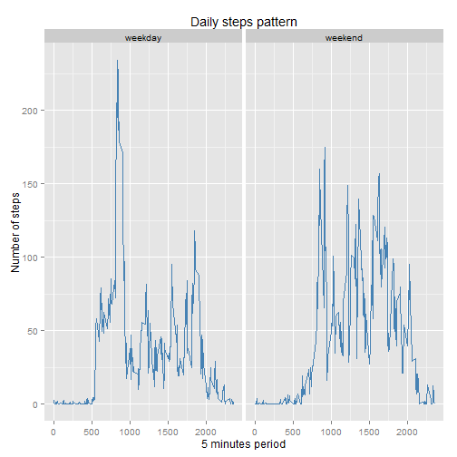

### Abstract
It is now possible to collect a large amount of data about personal movement using activity monitoring devices. These type of devices are part of the "quantified self" movement - a group of enthusiasts who take measurements about themselves regularly to improve their health, to find patterns in their behavior, or because they are tech geeks.

---

### Index
- Introduction
- Descriptive analysis

---

## Introduction
This analysis aims to give a superficial view of a person's activity beahviour under the assignment scope of the  Reproducible Reserach online Course from May'15. For this goal, it was used data from a device, that collects data at 5 minute intervals through out the day. The data consists of two months of data from an anonymous individual collected during the months of October and November, 2012 and include the number of steps taken in 5 minute intervals each day. The data can be obtain on the [assignment page](https://d396qusza40orc.cloudfront.net/repdata%2Fdata%2Factivity.zip).  

## Descriptive analysis

```r
activity = read.csv("./data/activity.csv")
library(dplyr)
totalSteps = summarise(group_by(activity, date), stepsSum = sum(steps, na.rm=TRUE))
```
In average the studied individual makes 9354 steps each day and the median it's 10395. However, this values are likely biased due to days reporting zero steps, which could indicate that the data on those days were incorrectly collected.  

```r
# graph of the total number of steps taken each day
library(ggplot2)
g = ggplot(totalSteps, aes(as.Date(date), stepsSum), cex=0.7)
g + geom_histogram(stat="identity", fill="steelblue") + labs(x="Day", y="Number of steps", title="Total steps made by day") + geom_hline(aes(yintercept=mean(stepsSum)), color="darkred") + annotate("text", x=as.Date(totalSteps$date)[3], y=mean(totalSteps$stepsSum)*1.05, label="mean", cex=3) + geom_hline(aes(yintercept=median(stepsSum)), color="darkgreen") + annotate("text", x=as.Date(totalSteps$date)[3], y=median(totalSteps$stepsSum)*1.05, label="median", cex=3)
```

 
  

```r
activity_by_period = summarise(group_by(activity, interval), stepsAvg = mean(steps, na.rm=TRUE))
# graph of the average number of steps taken (averaged across all days) by interval
g = ggplot(activity_by_period, aes(interval, stepsAvg), cex=0.7)
g + geom_line(color="steelblue") + labs(x="5 minutes period", y="Number of steps", title="Daily steps pattern")
```

 

On average the individual usually makes more steps at 8:35 a.m.  

```r
maxSteps[which.max(activity_by_period$stepsAvg), ]
```

```
##     Group.1        x
## 104     835 206.1698
```

```r
# impute the interval mean on missing values
activity2 = merge(activity, activity_by_period, by="interval", all.x=TRUE)
activity2[is.na(activity2$steps)==TRUE, "steps"] = round(activity2[is.na(activity2$steps)==TRUE, "stepsAvg"], 0)
activity2 = activity2[order(activity2$date, activity2$interval), ]
totalSteps2 = summarise(group_by(activity2, date), stepsSum = sum(steps, na.rm=TRUE))
```

The dataset contains 2304 missing values. To address this issue it was imputed the 5-minute interval mean to ensure that the daily pattern isn't changed.  

After the missing value imputation, in average it's estimated that the studied individual makes 10766 steps each day and the median is 10762. Therefore, the data processing by imputing the 5-minute interval mean increased the original mean and median.  

```r
# graph of the total number of steps taken each day
g = ggplot(totalSteps2, aes(as.Date(date), stepsSum), cex=0.7)
g + geom_histogram(stat="identity", fill="steelblue") + labs(x="Day", y="Number of steps", title="Total steps made by day") + geom_hline(aes(yintercept=mean(stepsSum)), color="darkred") + annotate("text", x=as.Date(totalSteps2$date)[3], y=mean(totalSteps2$stepsSum)*1.08, label="mean", cex=3) + geom_hline(aes(yintercept=median(stepsSum)), color="darkgreen") + annotate("text", x=as.Date(totalSteps2$date)[3], y=median(totalSteps2$stepsSum)*1.05, label="median", cex=3)
```

 

As we can verify in the following graph, the studied individual makes more steps on the weekends, mainly beacuse it has an higher activity on the day.  

```r
# create the weekday variabe; the weekdays are written in portuguese, if needed change to your own language
activity$weekday = ifelse(as.factor(weekdays(as.Date(activity$date))) %in% c("sábado", "domingo"), "weekend", "weekday")
# mean by weekday
activity_by_period_weekday = summarise(group_by(activity, weekday, interval), stepsAvg=mean(steps , na.rm=TRUE))
# graph comparing the average number of steps taken per interval between weekdays and weekends
g = ggplot(activity_by_period_weekday, aes(interval, stepsAvg), cex=0.7)
g + geom_line(color="steelblue") + labs(x="5 minutes period", y="Number of steps", title="Daily steps pattern") + facet_grid(.~weekday)
```

 
