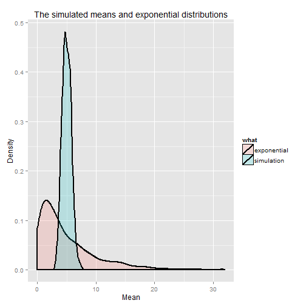

## Abstract
This is the project from the Coursera Statistical Inference online course from July 2015 and investigates the exponential distribution in R and compare it with the Central Limit Theorem.  


## Analysis
To investigate the exponential distribution, first will be created an distribution based on the means of 1000 simulations of the exponential distribution. Each exponential distribution is based on 40 observations and a lambda equal to 0.2.  


```r
library(ggplot2)

# simulate 1000 times the exponential distribution
mns <- NULL
for (i in 1 : 1000){mns <- c(mns, mean(rexp(40, rate=0.2)))}
mn <- as.data.frame(mns)
sample_mean <- mean(mn$mns)
sample_var <- sd(mn$mns)^2/length(mn$mns)

theoretical_mean <- 1/0.2
theoretical_var <- 1/0.2^2

# confidence interval for the means difference
sp <- sqrt((999 * sample_var + 999 * theoretical_var) / (1000 + 1000 - 2))
dci <- sample_mean - theoretical_mean + c(-1, 1) * qt(.995, 1998) * sp * sqrt(1 / 1000 + 1 / 1000)
```

The sample (in green) and theoretical (in red) means on the following graph are very close to each other, and we cannot reject the null hypotsis of the difference equals zero, even at a significance level of 99%. The confidence interval for their difference at this level is between -0.4116 and  0.4037.  


```r
# plotting the distribution and means
ggplot(mn, aes(x=mns)) + geom_histogram(fill="grey", binwidth=0.4, aes(y=..density..), colour="black") + geom_vline(xintercept=sample_mean, size=2, colour="darkgreen") + geom_vline(xintercept=theoretical_mean, size=2, colour="darkred") + labs(x="Mean", y="Density", title="Means distribution")
```

 

The theoretical variance is 25 and bigger than the one from the simulated distribution (6 &times; 10<sup>-4</sup>), because the second concentrates the observations around the theoretical mean. As the observations increase, it approximates of a normal distribution and the simulation mean will be closest of the theoretical mean.  


```r
dfm <- data.frame(rexp(1000, rate=0.2), mn)
colnames(dfm) <- c("exponential", "simulation")
what <- factor(rep(c("exponential", "simulation"), c(1000, 1000)))

# plotting the normal and simulated distributions 
ggplot(dfm, aes(x=c(exponential, simulation), fill=what)) + geom_density(size=1, alpha=0.2) + labs(x="Mean", y="Density", title="The simulated means and exponential distributions")
```

 

To understand if the simulated distribution is iid of a normal, we can use the standard normal distribution and sum both of them for checking if:  
$\sigma = \sqrt{\sigma_1^2 + \sigma_2^2}$  


```r
dfm <- data.frame(rnorm(1000), mn)
colnames(dfm) <- c("normal", "simulation")
dfm$test <- dfm$normal + dfm$simulation
sd1 <- sd(dfm$test)
sd2 <- sqrt(sd(dfm$normal)^2 + sd(dfm$simulation)^2)
```

Therefore the standard deviation for the sum of the two distributions is 1.2675 and for the square root of the two distributions variances sum is 1.2538, are very close as we could expect.
